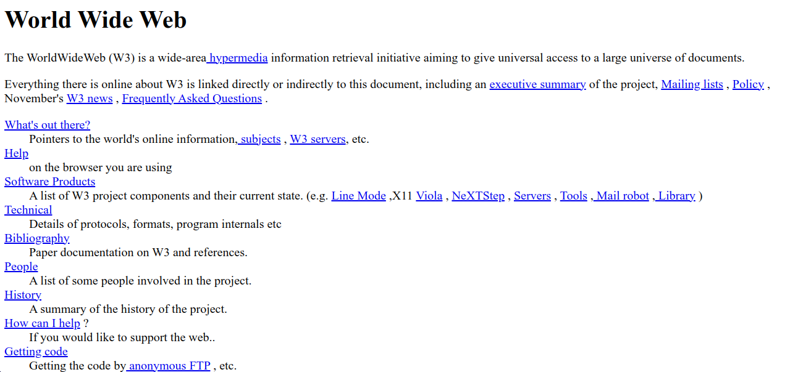

# HTML 5

HTML5 é a quinta versão do HTML (Hypertext Markup Language), a linguagem de marcação padrão usada para criar e estruturar conteúdo para a web. O HTML5 foi lançado em 2014 e trouxe várias melhorias e recursos em relação às versões anteriores.

O HTML5 também tornou a criação de páginas web mais acessível para dispositivos móveis, pois trouxe suporte nativo a responsividade, que permite que o layout da página se adapte automaticamente a diferentes tamanhos de tela.

# Imagem do Arquivo html

