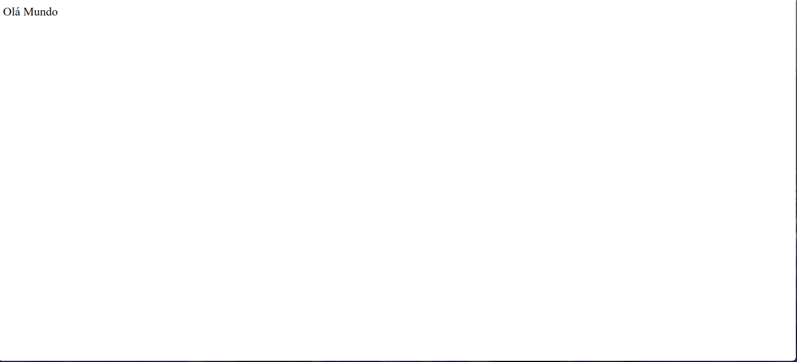

# Estrutura Final

```html
<!-- Definindo a versão do html -->
<!DOCTYPE html>
<!-- começo do Documento html -->
<html>
  <!-- Cabeça do Documento Hmtl -->
  <head lang="pt-br"> <!-- Adicionando idioma português -->
    <meta charset="utf-8" /> <!-- Setando os caracteres do abnt2 -->
    <title>Estrutura Final</title> <!-- Titulo do Documento html -->
    <!-- Final da cabeça do Documento html -->
  </head>
  <!-- Corpo do Documento Html -->
  <body>
    <!-- Texto simples -->
    Olá Mundo
    <!-- Final do corpo do Documento html -->
  </body>
  <!-- Final do Documento html -->
</html>
```

# Imagem do Html

